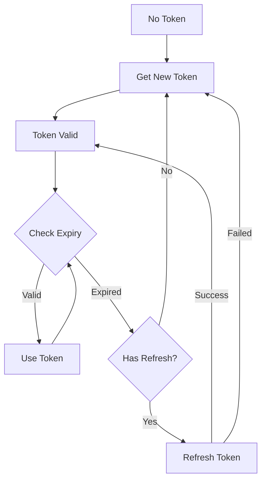

# Token Refresh Troubleshooting Guide

## ?? Why Token Refresh is Important

### The Problem with Your Original Code
```javascript
// ? PROBLEMATIC CODE - Only checks if token exists
const adminToken = pm.environment.get("admin_token");
if (!adminToken) {
    // Get new token...
}
```

**Issues:**
- ? Only checks if token exists, not if it's expired
- ? No expiration tracking
- ? Race conditions with multiple requests
- ? No refresh logic for user tokens
- ? No error handling for expired tokens

### The Improved Solution
```javascript
// ? IMPROVED CODE - Checks expiration and handles refresh
class TokenManager {
    isTokenExpired(tokenType = 'admin') {
        const expiryKey = tokenType === 'admin' ? 'admin_token_expiry' : 'user_token_expiry';
        const expiry = pm.environment.get(expiryKey);
        
        if (!expiry || expiry === '0') return true;
        
        const now = Math.floor(Date.now() / 1000);
        const expiryTime = parseInt(expiry);
        return now >= (expiryTime - 30); // 30 second buffer
    }
    
    async ensureAdminToken() {
        if (!this.isTokenExpired('admin')) {
            return pm.environment.get("admin_token");
        }
        return await this.getAdminToken();
    }
}
```

## ?? Common Token Refresh Issues

### Issue 1: "Token still shows as valid but request fails with 401"

**Cause:** Clock skew between client and server, or token was revoked

**Solution:**
```javascript
// Add larger buffer time
return now >= (expiryTime - 60); // 60 second buffer instead of 30

// Or force refresh on 401 errors
pm.test("Handle 401 errors", function () {
    if (pm.response.code === 401) {
        pm.environment.set("admin_token", "");
        pm.environment.set("admin_token_expiry", "0");
        console.log("Token expired, cleared for next request");
    }
});
```

### Issue 2: "Refresh token fails with 400 Bad Request"

**Cause:** Refresh token is expired or invalid

**Solution:**
```javascript
// Check refresh token expiry
const refreshTokenExpiry = pm.environment.get("refresh_token_expiry");
if (refreshTokenExpiry && Date.now() > refreshTokenExpiry * 1000) {
    console.log("Refresh token expired, need to login again");
    throw new Error("Refresh token expired - please login again");
}
```

### Issue 3: "Multiple requests trying to refresh at same time"

**Cause:** Race condition when multiple requests detect expired token

**Solution:**
```javascript
// Add refresh lock mechanism
if (pm.environment.get("token_refreshing") === "true") {
    // Wait for other request to finish refreshing
    await new Promise(resolve => setTimeout(resolve, 1000));
    return pm.environment.get("access_token");
}

pm.environment.set("token_refreshing", "true");
try {
    const newToken = await this.refreshUserToken();
    return newToken;
} finally {
    pm.environment.set("token_refreshing", "false");
}
```

### Issue 4: "Keycloak returns different token format"

**Cause:** Keycloak configuration changes or different client settings

**Solution:**
```javascript
// Robust token parsing
try {
    const jsonData = response.json();
    const accessToken = jsonData.access_token || jsonData.accessToken;
    const expiresIn = jsonData.expires_in || jsonData.expiresIn || 300;
    
    pm.environment.set("access_token", accessToken);
} catch (error) {
    console.error("Unexpected token response format:", response.text());
    throw error;
}
```

## ??? Keycloak Configuration for Proper Token Refresh

### Client Settings
1. **Access Token Lifespan**: 5 minutes (for testing), 15-30 minutes (production)
2. **Refresh Token Lifespan**: 30 minutes (testing), 1-8 hours (production) 
3. **Refresh Token Idle Time**: 15 minutes (testing), 30 minutes (production)
4. **Enable Refresh Token Rotation**: ON (recommended for security)

### Realm Settings
```json
{
  "accessTokenLifespan": 300,
  "refreshTokenMaxReuse": 0,
  "revokeRefreshToken": true,
  "refreshTokenIdleTimeoutRememberMe": 1800
}
```

## ?? Testing Token Refresh

### Test Scenario 1: Automatic Admin Token Refresh
```bash
# 1. Run any admin endpoint
# 2. Wait 5+ minutes
# 3. Run same endpoint again
# 4. Check console logs for "Admin token missing or expired, acquiring new token..."
```

### Test Scenario 2: User Token Refresh
```bash
# 1. Login user (get access + refresh tokens)
# 2. Wait 5+ minutes  
# 3. Run user endpoint (like /userinfo)
# 4. Check console logs for "User token missing or expired, attempting refresh..."
```

### Test Scenario 3: Refresh Token Expiry
```bash
# 1. Login user
# 2. Wait 30+ minutes (refresh token expiry)
# 3. Try to use any user endpoint
# 4. Should fail with "No refresh token available - please login again"
```

## ?? Token Lifecycle States



## ?? Debugging Token Issues

### Enable Detailed Logging
```javascript
// Add to pre-request script
const DEBUG_TOKENS = true;

if (DEBUG_TOKENS) {
    console.log("?? Token Debug Info:");
    console.log("   Access Token:", pm.environment.get("access_token")?.substring(0, 50) + "...");
    console.log("   Refresh Token:", pm.environment.get("refresh_token")?.substring(0, 50) + "...");
    console.log("   Admin Token:", pm.environment.get("admin_token")?.substring(0, 50) + "...");
    console.log("   User Token Expiry:", pm.environment.get("user_token_expiry"));
    console.log("   Admin Token Expiry:", pm.environment.get("admin_token_expiry"));
    console.log("   Current Time:", Math.floor(Date.now() / 1000));
}
```

### Check Token Content
```javascript
// Decode JWT payload for debugging
function decodeJWT(token) {
    try {
        const parts = token.split('.');
        const payload = JSON.parse(atob(parts[1].replace(/-/g, '+').replace(/_/g, '/')));
        return payload;
    } catch (error) {
        console.error("Cannot decode JWT:", error);
        return null;
    }
}

const payload = decodeJWT(pm.environment.get("access_token"));
if (payload) {
    console.log("Token payload:", {
        sub: payload.sub,
        exp: new Date(payload.exp * 1000).toISOString(),
        iat: new Date(payload.iat * 1000).toISOString(),
        roles: payload.realm_access?.roles
    });
}
```

## ?? Error Codes and Solutions

| Error Code | Meaning | Solution |
|------------|---------|----------|
| 400 | Bad Request | Check request format, client credentials |
| 401 | Unauthorized | Token expired or invalid, refresh needed |
| 403 | Forbidden | Valid token but insufficient permissions |
| 404 | Not Found | Wrong endpoint URL or realm name |
| 500 | Server Error | Keycloak issue, check server logs |

## ?? Best Practices

1. **Always use expiry buffers** (30-60 seconds)
2. **Handle refresh token rotation** (store new refresh token)
3. **Implement proper error handling** (401, 403, etc.)
4. **Log token operations** for debugging
5. **Use collection-level scripts** for consistent behavior
6. **Test token refresh scenarios** regularly
7. **Set appropriate token lifespans** for your use case
8. **Monitor token refresh rates** in production

## ?? Quick Fix Checklist

When token refresh isn't working:

- [ ] Check Keycloak is running (`http://localhost:8080`)
- [ ] Verify client secret is correct
- [ ] Confirm token lifespans are set properly
- [ ] Check console logs for error messages
- [ ] Verify environment variables are set
- [ ] Test with fresh login
- [ ] Check for typos in token endpoint URLs
- [ ] Verify refresh token rotation settings
- [ ] Test individual token refresh request manually
- [ ] Check Keycloak server logs for errors